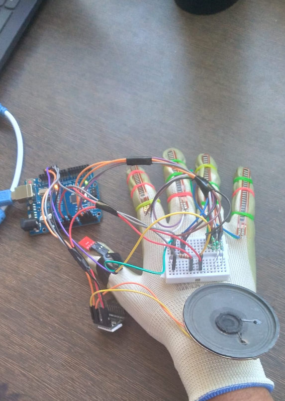

# 🧠 NEUROGLOVE – AI-Powered Smart Glove for Patient Care

NEUROGLOVE is an intelligent, multifunctional wearable glove designed to assist patients and individuals with disabilities by integrating gesture control, health monitoring, location tracking, and smart automation.

Built using Arduino Mega and inspired by the real-life needs of elderly and differently-abled individuals, NEUROGLOVE brings innovation and care to the fingertips.

---

## 🔍 Project Overview

NEUROGLOVE combines AI algorithms, sensors, wireless communication, and gesture recognition to:

- ❤️ Monitor health parameters (pulse, temperature)
- 🚨 Send emergency alerts
- 🏠 Control smart devices (lights, fans, alarms)
- 🧭 Track location using GPS
- 👐 Enable gesture-based communication for individuals with speech or motor impairments

---

## 🚀 Features

| Feature | Description |
|--------|-------------|
| ✋ Gesture Recognition | Detects hand movements to control devices or trigger actions |
| ❤️ Health Monitoring | Continuously tracks pulse rate and temperature |
| 🧭 GPS Location Tracking | Sends real-time coordinates during emergencies |
| 📡 Wireless Communication | RF & Wi-Fi modules send alerts remotely |
| 🏠 Home Automation | Control lights, fan, and alarm with glove gestures |
| 🚨 Emergency Mode | Sends alert when abnormal vitals are detected |

---

## 🧰 Hardware Components

| Component | Purpose |
|-----------|---------|
| Arduino Mega | Main microcontroller |
| Pulse Sensor | Heart rate monitoring |
| Temperature Sensor | Body temperature sensing |
| GPS Module | Real-time location tracking |
| HC-12 / RF Module | Wireless emergency alerts |
| Wi-Fi Module (ESP8266) | Internet-based messaging |
| Relay Module | Controls light, fan, and alarm |
| Flex Sensors (×4) | Detects hand gestures |
| Buzzer / Speaker | Audio alert system |
| LEDs | Status indicators |
| Battery Pack | Power source |
| Glove | Wearable interface |

---

## 🔧 How It Works

1. User wears the smart glove embedded with flex and health sensors.
2. The glove continuously monitors pulse rate and temperature.
3. Recognized hand gestures trigger specific actions:
   - Turn on/off lights and fans
   - Send emergency alerts
   - Activate buzzers or alarms
4. If abnormal health data is detected:
   - GPS module retrieves coordinates
   - RF module sends alert with location to caregivers

---

## 🛠️ Setup Instructions

1. Connect hardware based on the circuit diagram (see `/schematics`).
2. Upload the code to Arduino Mega using the Arduino IDE.
3. Power up the glove using a rechargeable battery pack.
4. Calibrate sensor thresholds (e.g., for pulse and temperature).
5. Test gesture responses and validate health sensor readings.

---

## 📸 Project Media

  

---

---

